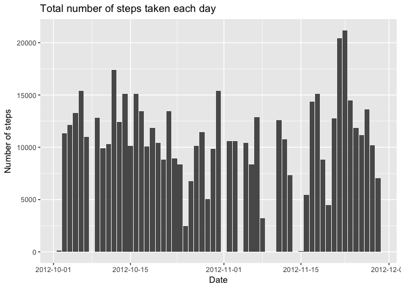
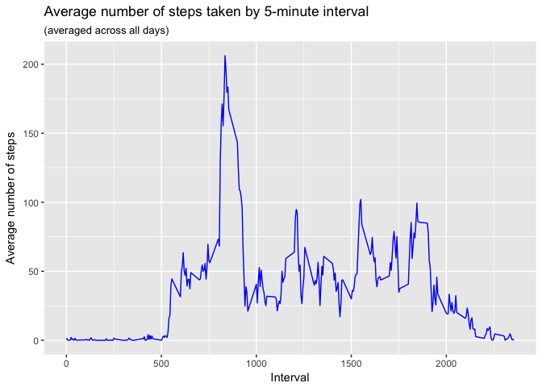
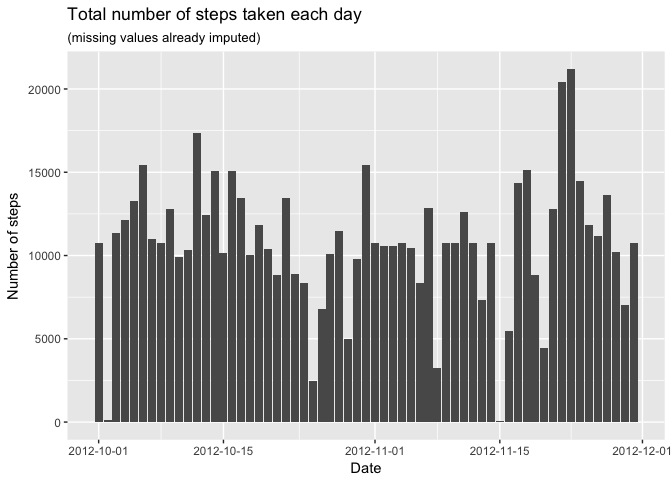
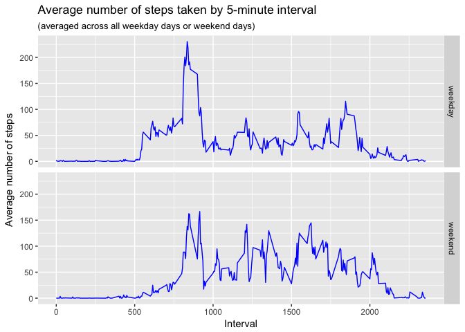

# Reproducible Research: Peer Assessment 1


## Loading and preprocessing the data

```r
df <- read.csv(file = unz("activity.zip", filename = "activity.csv"),
               header = TRUE, sep = ",", na.strings = NA, nrows = 17568,
               colClasses = c("integer", "Date", "integer"))
```


## What is mean total number of steps taken per day?
**1. Calculate the total number of steps taken per day:**

```r
temp.v1 <- aggregate(steps ~ date, data = df, FUN = "sum")
```

**2. Make a histogram of the total number of steps taken each day:**

```r
library(ggplot2)
ggplot(temp.v1, aes(x = date, y = steps)) +
    geom_histogram(stat = "identity") +
    labs(title = "Total number of steps taken each day",
         x = "Date", y = "Number of steps") +
    scale_x_date(date_labels = "%Y-%m-%d")
```

<!-- -->

**3. Calculate and report the mean and median of the total number of steps taken per day:**

```r
steps.mean <- mean(temp.v1$steps)
steps.median <- median(temp.v1$steps)
```
- The mean number of steps taken per day is **10766.19** and the median is **10765**.


## What is the average daily activity pattern?
**1. Make a time-series plot of the 5-minute interval (x-axis) and the average number of steps taken, averaged across all days (y-axis):**

```r
temp <- aggregate(steps ~ interval, data = df, FUN = "mean")
ggplot(data = temp, aes(x = interval, y = steps)) +
    geom_line(color = "blue") +
    labs(title = "Average number of steps taken by 5-minute interval",
         subtitle = "(averaged across all days)",
         x = "Interval", y = "Average number of steps")
```

<!-- -->

**2. Which 5-minute interval, on average across all the days in the dataset, contains the maximum number of steps?**

```r
max.interval <- temp$interval[which.max(temp$steps)]
```
- **835** is the 5-minute interval that contains the maximum number of steps.


## Imputing missing values
**1. Calculate and report the total number of missing values in the dataset (i.e. the total number of rows with NAs)**

```r
total.na <- sum(is.na(df$steps))
```
- All the **2304** missing values in the dataset belong to the attribute `steps`.

**2. Devise a strategy for filling in all of the missing values in the dataset. The strategy does not need to be sophisticated. For example, you could use the mean/median for that day, or the mean for that 5-minute interval, etc.**
- Since the average number of steps have already been calculated for all the 5-minute intervals, I'm going to use them to replace the NAs in the `steps` attribute.

**3. Create a new dataset that is equal to the original dataset but with the missing data filled in.**

```r
# Copy the original dataset
df.new <- df
# Indexes of all the NAs in the variable "steps"
na.indexes <- which(is.na(df.new$steps))
for(na.index in na.indexes) {
    value <- temp[df.new$interval[na.index] == temp$interval, ]$steps
    df.new$steps[na.index] <- value
}
# Total number of steps by date
temp.v2 <- aggregate(steps ~ date, data = df.new, FUN = "sum")
```

**4. Make a histogram of the total number of steps taken each day...**

```r
library(ggplot2)
ggplot(temp.v2, aes(x = date, y = steps)) +
    geom_histogram(stat = "identity") +
    labs(title = "Total number of steps taken each day",
         subtitle = "(missing values already imputed)",
         x = "Date", y = "Number of steps") +
    scale_x_date(date_labels = "%Y-%m-%d")
```

<!-- -->

**... and calculate and report the mean and the median total number of steps taken per day.**

```r
steps.mean.v2 <- mean(temp.v2$steps)
steps.median.v2 <- median(temp.v2$steps)
```
- The mean number of steps taken per day is **10766.19** and the median is **10766.19**.

**4.1. Do these values differ from the estimates from the first part of the assignment?**  
- The mean value does not change whereas the new median value is slightly greater than before and equal to the mean value.

**4.2. What is the impact of imputing missing data in the estimates of the total daily number of steps?**  
- There are no empty dates now in the histogram and, in addition, the total number of steps changed from **570608** to **656737.5**.


## Are there differences in activity patterns between weekdays and weekends?
**1. Create a new factor variable in the dataset with two levels --"weekday" and "weekend" indicating whether a given date is a weekday or weekend day.**

```r
df.new$day <- as.factor(
    ifelse(
        weekdays(df.new$date, abbreviate = TRUE) %in% c("sáb","dom"),
        yes = "weekend",
        no = "weekday"))
```

**2. Make a panel plot containing a time series plot (i.e. type = "l") of the 5-minute interval (x-axis) and the average number of steps taken, averaged across all weekday days or weekend days (y-axis).**

```r
temp <- aggregate(steps ~ interval + day, data = df.new, FUN = "mean")
ggplot(temp, aes(x = interval, y = steps)) +
    geom_line(color = "blue") +
    facet_grid(day ~ .) +
    labs(title = "Average number of steps taken by 5-minute interval",
         subtitle = "(averaged across all weekday days or weekend days)",
         x = "Interval", y = "Average number of steps")
```

<!-- -->
